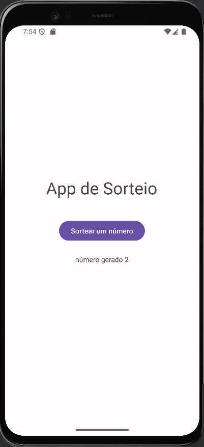

<h1 align="center">
   
</h1>

<h4 align="center"> 
	🚧 Cuidapet 🚀 Concluido...  🚧
</h4>

## ✅ Funções

- <h3>SORTEIO</h3>

  - [x] Gerar número

## 📚 Descrição

Meu primeiro aplicativo desenvolvido em Kotlin

## 🛠 Tecnologias

As seguintes ferramentas foram usadas na construção do projeto:

-  [Flutter](https://flutter.dev/?gclid=Cj0KCQjwkbuKBhDRARIsAALysV4sMSKWcOxrlBmdtlCcf3MAfNdH1ehbbWi6ZjjjdypPLsSvdTFiqOYaAon3EALw_wcB&gclsrc=aw.ds)
## 📱 Plataforma adotada

- Android;
